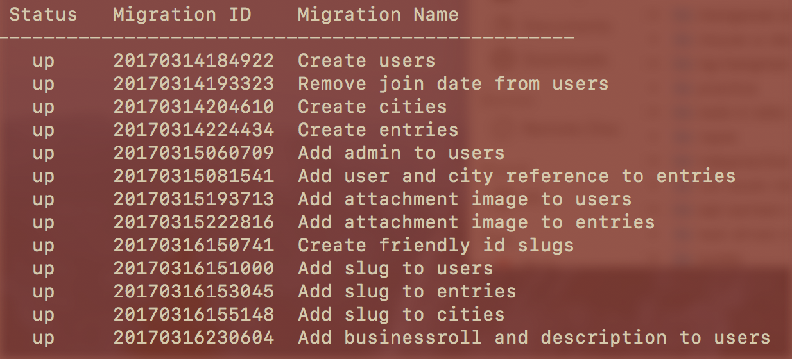

# Vagabond


## Technologies used
- Ruby on Rails
- RESTful API
- HTML
- CSS, Bootstrap

## Installation

# To spin up a local server:
- Set up required gems. ```bundle install```
- This app requires  ImageMagick for uploading images to Vagabond. ```Brew install ImageMagick```
- Create a database. ```rails db:create```
- Now that we have a database, migrate in our various models and other assorted data to the database. ```rails db:migrate```
- Check the migration status. ```rails db:migrate:status```. You should see:


- If you want to include some dummy info on your local server, run ```rails db:seed``` some seed data. Additionally, you can modify the seed file to show whatever types of information suits your requirements.

:tada:
- ****

## Existing Features
- User log in with privileges based on role
- Redirection based on auth status
- User profile page
- Upload images
- Default user image
- City shows posts that are associated with it
- CRUD ACTIONS!
- Pretty urls

## Planned Features
